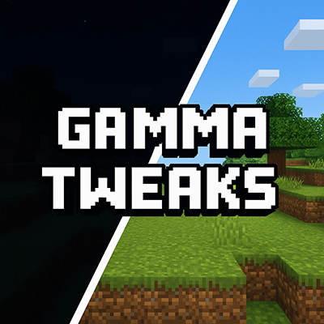
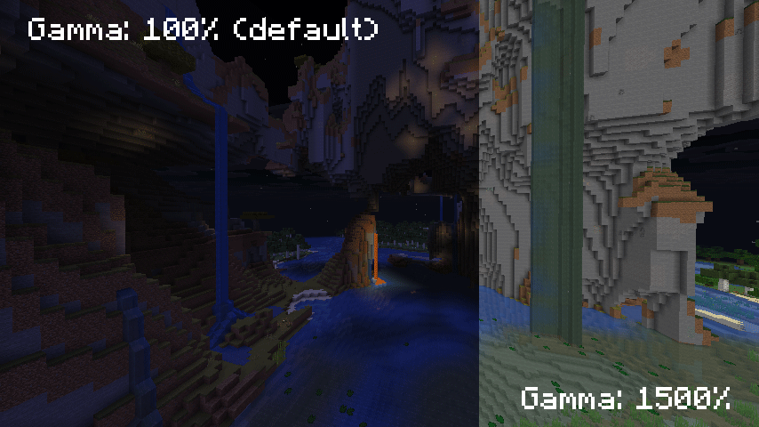
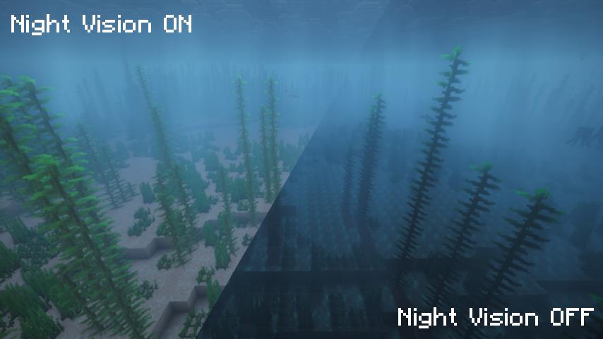
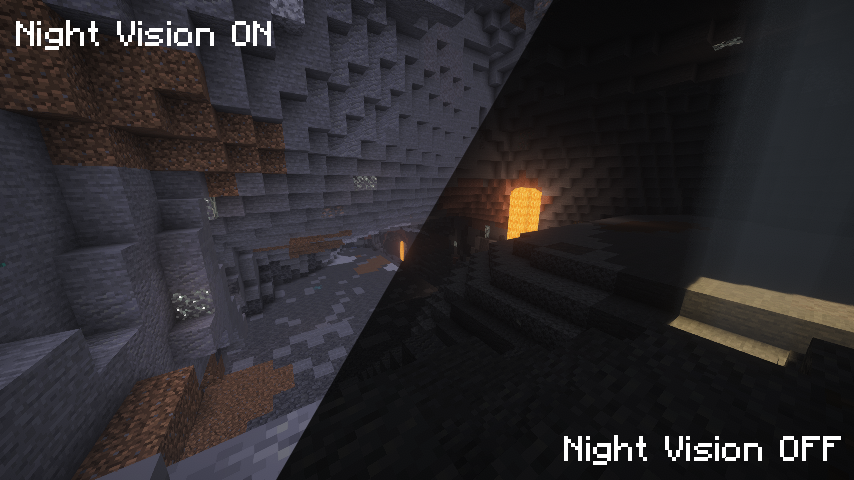

# Gamma Tweaks Port for NeoForge 1.21.10




A client-side Minecraft mod that provides advanced gamma (brightness) and night vision control beyond vanilla limits.

**[Features](#-features) • [Installation](#-installation) • [Configuration](#️-configuration) • [Building](#️-building-from-source) • [Credits](#-credits)**

---

## ✨ Features

- 🌟 **Extended Gamma Range**: Adjust brightness from -750% to 1500% (far beyond vanilla limits)
- 🌙 **Custom Night Vision**: Enable night vision without potions (0-100% strength)
- 🎨 **Dynamic Gamma**: Automatically adjusts gamma based on surrounding light levels
- ✨ **Smooth Transitions**: Optional smooth transitions between gamma levels
- ⚡ **Status Effects**: Visual status effect indicators for gamma and night vision
- 🎮 **Customizable Keybindings**: Quick access to all features via keyboard shortcuts
- 🌍 **Dimension Preferences**: Set different gamma/night vision per dimension (Overworld, Nether, End)
- 📊 **HUD Messages**: Visual feedback with customizable colors
- 🖥️ **Commands**: Full command support for precise control
- 🚀 **Client-Side Only**: Works on any server, no server-side installation needed

## 🎬 Demo



*Toggle gamma and night vision with smooth transitions and visual feedback*

---

## 📦 Installation

1. Install [NeoForge](https://neoforged.net/) 21.10.47-beta or higher for Minecraft 1.21.10
2. Download the latest release from [Releases](https://github.com/smallinger/gamma-tweaks/releases)
3. Place the `.jar` file in your `mods` folder
4. Launch Minecraft and enjoy!

### ⚠️ Important Notes

#### Shader Compatibility
This mod includes **automatic shader detection** for Iris/Oculus. When shaders are enabled, you may receive a warning if gamma is activated, as shader packs can conflict with gamma adjustments.

#### Compatibility
- ✅ Works with Sodium, Lithium, and other performance mods
- ✅ Compatible with Iris Shaders (with automatic detection)
- ✅ Client-side only - works on any server
---


### Shader Examples




*Toggle gamma and night vision with smooth transitions and visual feedback*

## ⚙️ Configuration

Access the configuration through:

- **Mods Menu** → **Gamma Tweaks** → **Config**

### Available Settings

#### Gamma Settings
| Setting | Description | Default |
|---------|-------------|---------|
| Default Gamma | Base gamma value (%) | 100% |
| Toggled Value | Value when toggled | 1500% |
| Step Value | Increment/decrement amount | 100% |
| Min/Max Strength | Range limits | -750% to 1500% |
| Smooth Transition | Enable smooth transitions | ✓ |
| Transition Speed | Animation speed (ms) | 100ms |
| Reset on Close | Reset to default on game close | ✗ |

#### Night Vision Settings
| Setting | Description | Default |
|---------|-------------|---------|
| Enabled | Night vision status | ✗ |
| Default Value | Base night vision value (%) | 100% |
| Toggled Value | Value when toggled | 100% |
| Step Value | Increment/decrement amount | 25% |
| Min/Max Strength | Range limits | 0% to 100% |
| Smooth Transition | Enable smooth transitions | ✓ |
| Transition Speed | Animation speed (ms) | 100ms |
| Brighten Fog Color | Brighten fog during night vision | ✓ |

#### Dynamic Gamma
| Setting | Description | Default |
|---------|-------------|---------|
| Enabled | Auto-adjust based on light | ✗ |
| Light Range | Detection radius | 3 blocks |
| Min/Max Strength | Auto-adjustment range | 0% to 1500% |
| Transition Speed | Animation speed (ms) | 1500ms |

#### Dimension Preferences
| Setting | Description | Default |
|---------|-------------|---------|
| Gamma Preferences | Enable per-dimension gamma | ✗ |
| Overworld Gamma | Overworld default | 100% |
| Nether Gamma | Nether default | 100% |
| End Gamma | End default | 100% |
| Night Vision Preferences | Enable per-dimension NV | ✗ |
| Overworld NV | Overworld default | 0% |
| Nether NV | Nether default | 0% |
| End NV | End default | 0% |

---

## 🎮 Controls

### Gamma Controls
| Key | Action | Description |
|-----|--------|-------------|
| `G` | Toggle Gamma | Toggle between default and toggled value |
| `↑` | Increase Gamma | Increase by step value |
| `↓` | Decrease Gamma | Decrease by step value |
| Unbound | Max Gamma | Set to maximum |
| Unbound | Min Gamma | Set to minimum |

### Night Vision Controls
| Key | Action | Description |
|-----|--------|-------------|
| `H` | Toggle Night Vision | Enable/disable night vision |
| `→` | Increase Night Vision | Increase by step value |
| `←` | Decrease Night Vision | Decrease by step value |

*All keybindings can be customized in Minecraft's Controls settings*

---

## 💻 Commands

### Gamma Commands
```
/gamma                           # Toggle gamma
/gamma <value>                   # Set gamma to specific value (percentage)
/gamma toggle                    # Toggle gamma
/gamma min                       # Set to minimum
/gamma max                       # Set to maximum
/gamma set <value>               # Set gamma to specific value
/gamma increase [value]          # Increase gamma (by step or specified value)
/gamma decrease [value]          # Decrease gamma (by step or specified value)
/gamma dynamic [toggle|enable|disable]  # Control dynamic gamma
/gamma statuseffect [toggle|enable|disable|percentage]  # Control gamma status effect
```

### Night Vision Commands
```
/nightvision                     # Toggle night vision
/nightvision <value>             # Set night vision to specific value (percentage)
/nightvision toggle              # Toggle night vision
/nightvision enable              # Enable night vision
/nightvision disable             # Disable night vision
/nightvision set <value>         # Set night vision to specific value
/nightvision increase [value]    # Increase night vision (by step or specified value)
/nightvision decrease [value]    # Decrease night vision (by step or specified value)
/nightvision dynamic [toggle|enable|disable]  # Control dynamic night vision
/nightvision statuseffect [toggle|enable|disable|percentage]  # Control NV status effect
```

---

## 🛠️ Building from Source

```bash
git clone https://github.com/smallinger/gamma-tweaks.git
cd gamma-tweaks
./gradlew build
```

The compiled `.jar` will be in `build/libs/`

---

## 🎯 Technical Details

### Architecture

```
com.github.gammatweaks/
├── GammaTweaks.java                 # Main mod initialization
├── GammaTweaksClient.java           # Client-side setup & event handling
├── GammaTweaksCommands.java         # Command registration
├── Config.java                      # NeoForge config system (TOML)
├── manager/
│   ├── GammaManager.java            # Gamma control logic
│   └── NightVisionManager.java      # Night vision control logic
├── keybindings/
│   └── KeyBindings.java             # Key mapping registration
├── statuseffect/
│   ├── GammaStatusEffect.java       # Custom status effect implementation
│   └── StatusEffectManager.java     # Status effect coordination
├── util/
│   ├── InfoProvider.java            # HUD message system
│   └── LightLevelUtil.java          # Light level calculations
└── mixin/
    ├── MixinOptions.java            # Options file handling
    ├── MixinOptionInstance.java     # Gamma option override
    ├── MixinLightmapTextureManager.java  # Light texture modification
    ├── MixinFogRenderer.java        # Fog color adjustment
    ├── MixinGameRenderer.java       # Night vision scale
    ├── MixinGui.java                # Status effect rendering
    ├── MixinMinecraft.java          # Game close handling
    ├── MixinMobEffectUtil.java      # Effect duration formatting
    └── MixinClientPacketListener.java  # World load/respawn handling
```

### Key Changes from Fabric

- **Config System**: Migrated from AutoConfig (JSON) to NeoForge's ModConfigSpec (TOML)
- **Key Bindings**: Uses NeoForge's `RegisterKeyMappingsEvent`
- **Events**: `LevelTickEvent.Pre` instead of Fabric's `ClientTickEvents`
- **Commands**: NeoForge's `RegisterClientCommandsEvent` instead of Fabric's API
- **Mixins**: Updated for NeoForge class mappings (Options, OptionInstance, LightTexture, Gui, etc.)
- **Status Effects**: Adapted to NeoForge's MobEffect system

---

## 📜 Credits

- **Author**: [Smallinger](https://github.com/smallinger/gamma-tweaks)
- **Icons**: Adapted from [Gamma Utils](https://github.com/sjouwer/gamma-utils) (LGPL-3.0)
- **Inspired by**: [Gamma Utils for Fabric](https://github.com/sjouwer/gamma-utils) by Sjouwer

---

## 🐛 Issues & Support

Found a bug or have a suggestion?

- **Open an issue**: [GitHub Issues](https://github.com/smallinger/gamma-tweaks/issues)

---

## 💖 Support My Work

If you like what I do, consider supporting me:

[](https://ko-fi.com/smallpox)

---

## 📄 License

This project is licensed under the MIT License - see the [LICENSE](LICENSE) file for details.

### Third-Party Assets

- **Status Effect Icons**: Licensed under GNU LGPL v3.0 from [Gamma Utils](https://github.com/sjouwer/gamma-utils)

---

**Made with ❤️ for the Minecraft community**
